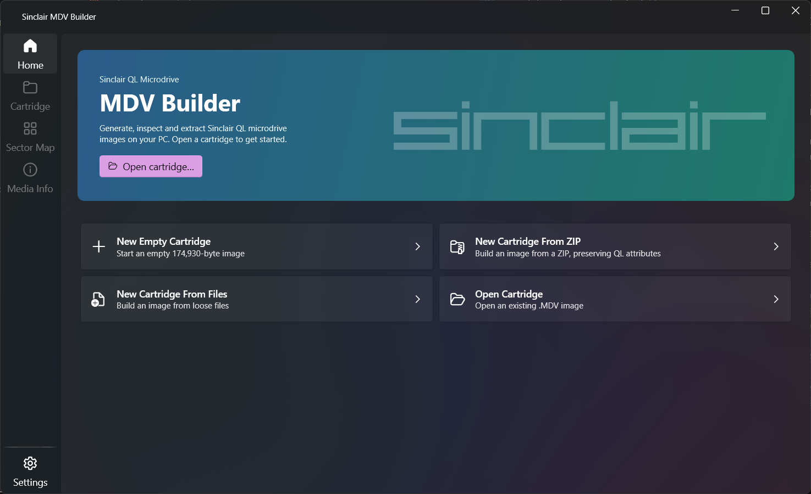
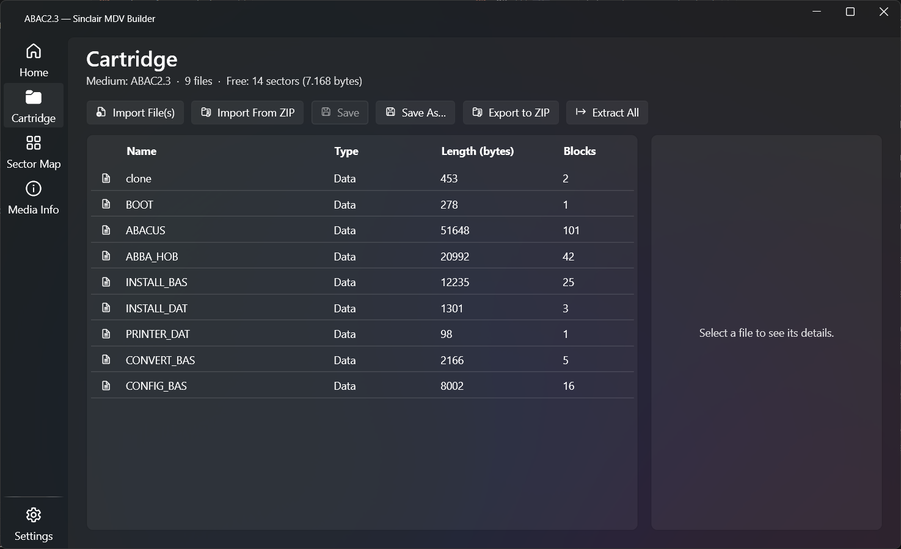

# Sinclair MDV Builder

A Windows desktop tool to **create, inspect, edit, and extract files from Sinclair QL Microdrive
images** (`.MDV`). It is a PC-side companion for authoring cartridge images — including ones for
the [MicroPicoDrive](https://github.com/gusmanb/micropicodrive) hardware replacement for the QL
Microdrive.

Built with **C# (.NET 8) + WPF** and the [WPF-UI](https://github.com/lepoco/wpfui) Fluent design
library, over a GUI-free format engine (`MdvCore`).

---

## Screenshots

| Home | Browsing a cartridge |
|:---:|:---:|
| [](docs/home.png) | [](docs/cartridge.png) |

---

## Features

- **Create cartridges**
  - New empty cartridge (174,930-byte MDV image)
  - New cartridge from loose files
  - New cartridge from a ZIP archive
- **Open / Save / Eject**
  - Open and save `.MDV` images (Save / Save As)
  - Eject the current cartridge (with an unsaved-changes guard)
- **Inspect**
  - Directory listing with file type, length, block count
  - File detail panel: name, type, length, data-space, file number, blocks, CRC-32, and the
    decoded QL file header (collapsible)
  - Hex / text viewer with search (per-file, opens on double-click, Enter, or Inspect)
  - Sector map: colour-coded used / free / damaged / map sectors, with hover info and per-file
    highlighting
  - Media info: format, medium name/id, capacity, used/free/damaged counts, file count
- **File operations**
  - Import file(s) — multi-select; packs in as many as fit, warns about any left out
  - Import from ZIP (and the matching Export to ZIP)
  - Extract a file, or Extract All to a folder
  - Duplicate, Rename, Delete, and Set Exec (toggle executable, prompting for data space)
- **QL-aware ZIP** — export/import preserve QL file **type** and **data-space** via the QDOS
  `0xFB4A` extra field (compatible with the qlzip convention); ordinary ZIPs import as data files
- **Sector allocation strategy** — Sequential (default, contiguous from the start), Spaced, or
  Random; selectable in Settings
- **Quality-of-life** — drag-and-drop (drop files to import, drop an `.mdv` to open), keyboard
  shortcuts, light/dark theme, unsaved-changes indicator in the title bar

> **Note:** generated images round-trip through this tool's own loader and test suite, but have
> not yet been validated on stock QL ROM / an emulator. The DMP and MPD formats, and over-the-air
> transfer, are not implemented yet.

---

## Usage

### Requirements
- **To run:** the [.NET 8 Desktop Runtime](https://dotnet.microsoft.com/download/dotnet/8.0)
  (Windows 11 does not include it by default).
- **To build:** the [.NET 8 SDK](https://dotnet.microsoft.com/download/dotnet/8.0).

### Run from source
```bash
dotnet run --project MdvApp
```

### Build and test
```bash
dotnet build                       # build the whole solution
dotnet test                        # run the MdvCore unit tests
```

### Publish a release
Framework-dependent single file (small; needs the .NET 8 Desktop Runtime installed):
```bash
dotnet publish MdvApp -c Release -r win-x64 --self-contained false -p:PublishSingleFile=true -p:DebugType=none
```
Self-contained single file (large; runs with nothing pre-installed):
```bash
dotnet publish MdvApp -c Release -r win-x64 --self-contained true -p:PublishSingleFile=true -p:DebugType=none
```
The published `MdvApp.exe` is written under `MdvApp/bin/Release/net8.0-windows/win-x64/publish/`.

### Quick start
1. From **Home**, choose *New Empty Cartridge*, *New Cartridge From Files/ZIP*, or *Open
   cartridge…* (you can also drag an `.mdv` onto the window).
2. On the **Cartridge** page, use the toolbar to Import File(s) / Import From ZIP / Save / Save
   As / Export to ZIP / Extract All, or drag files onto the list to import them.
3. Select a file to see its details; double-click (or Enter / Inspect) to view its contents;
   use Rename / Duplicate / Extract / Set Exec / Delete in the detail panel.
4. **Sector Map** and **Media Info** show the layout and properties of the open cartridge.

You can also open an image directly by passing its path on the command line
(`mdv-builder.exe path\to\image.mdv`) or by associating `.mdv` files with the app.

**Shortcuts:** Ctrl+O open · Ctrl+N new · Ctrl+S save · Ctrl+Shift+S save as · Enter inspect ·
F2 rename · Delete remove.

---

## Licensing & copyright

Copyright © 2026 Arley Silveira. Released under the **MIT License** — see [LICENSE](LICENSE).

This project bundles or builds upon the following third-party components, used under their
respective licenses:

| Component | License | Copyright |
|---|---|---|
| [WPF-UI](https://github.com/lepoco/wpfui) | MIT | © lepo.co (lepoco) |
| [SharpZipLib](https://github.com/icsharpcode/SharpZipLib) | MIT | © ICSharpCode |
| Fluent System Icons (via WPF-UI) | MIT | © Microsoft Corporation |
| .NET / WPF | MIT | © Microsoft Corporation |

The MDV/DMP/MPD on-disk format and the QL-aware ZIP convention were learned from
[gusmanb/micropicodrive](https://github.com/gusmanb/micropicodrive); the format engine in this
project is an independent re-implementation.

> If you intend to distribute binaries, include the MIT license notices for the components above
> (e.g. a `THIRD-PARTY-NOTICES` file) and confirm any attribution requirements of the reference
> project.
